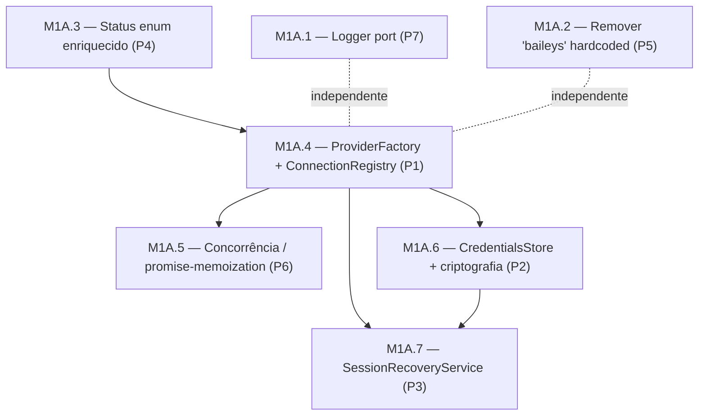
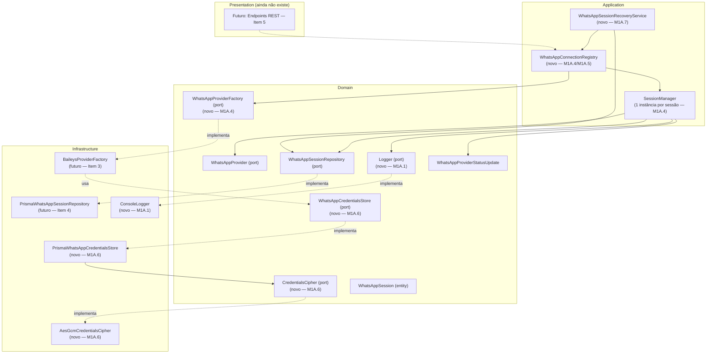
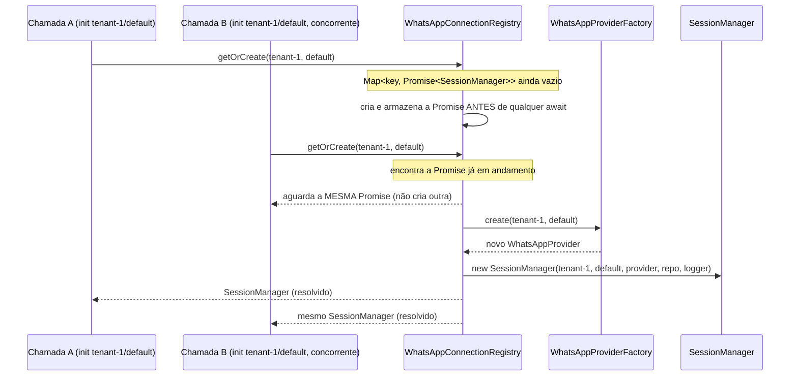

# M1A — Architecture Hardening (plano de implementação)

> Sub-milestone criada a partir do Architecture Review de 2026-07-06 (veredito: "Arquitetura ainda não está pronta"). Cobre exclusivamente os problemas P1–P7 classificados como "obrigatório corrigir antes do Baileys". Este documento é apenas planejamento — nenhum código foi escrito.
>
> **ENCERRADO em 2026-07-06.** Um Architecture Gate Review posterior (simulando escala de produção) substituiu a itemização M1A.2–M1A.7 abaixo por um escopo mais preciso: apenas os achados F2 (canal de eventos genérico) e F6 (`provider` como enum), mais validação do schema, precisavam ser resolvidos antes do Baileys. Os achados F1/F3/F4/F5/F9 (que cobrem, respectivamente, o que seriam M1A.4–M1A.7) foram registrados como ADRs (#16–#20 em `DECISIONS.md`) e conscientemente adiados, não implementados. **M1A.6 (P2 — persistência de credenciais do Baileys)**, abaixo, havia ficado de fora do Gate Review por uma falha de processo, mas foi resolvido em rodada posterior com um desenho mais genérico (`CredentialsStore`/`Cipher` em `shared/security/`, não específico do Baileys) — ver ADR #21 e `PROJECT_STATUS.md` §9.4. Ver `PROJECT_STATUS.md` §9–§10 para o estado final real. Este documento permanece como registro histórico do plano original.

---

## 1. Ordem exata de implementação

| Ordem | Item | Problema original | Depende de |
|---|---|---|---|
| 1 | **M1A.1** — Logger port (Domain) | P7 | Nenhum |
| 2 | **M1A.2** — Remover `'baileys'` hardcoded | P5 | Nenhum |
| 3 | **M1A.3** — Enriquecer `WhatsAppSessionStatus` | P4 | Nenhum (mas deve vir antes de M1A.4) |
| 4 | **M1A.4** — `WhatsAppProviderFactory` + `WhatsAppConnectionRegistry` | P1 | M1A.3 |
| 5 | **M1A.5** — Concorrência via promise-memoization no Registry | P6 | M1A.4 |
| 6 | **M1A.6** — `WhatsAppCredentialsStore` (persistência + criptografia) | P2 | M1A.4 |
| 7 | **M1A.7** — `WhatsAppSessionRecoveryService` (bootstrap) | P3 | M1A.4, M1A.6 |

**Racional da ordem**: M1A.1 e M1A.2 são independentes e baratos — entram primeiro para não precisar retrabalhar itens maiores depois. M1A.3 precisa vir antes de M1A.4 porque o redesenho do `SessionManager` deve nascer já usando o vocabulário de status completo (evita reabrir o mesmo arquivo duas vezes). M1A.4 é o item estrutural do qual M1A.5, M1A.6 e M1A.7 dependem — todos usam o `WhatsAppConnectionRegistry`/`WhatsAppProviderFactory` que ele introduz. M1A.7 fecha por último porque precisa tanto do Registry (M1A.4) quanto das credenciais persistidas (M1A.6) para restaurar sessões de verdade.

## 2. Dependências entre itens (diagrama)



## 3. ADRs necessárias

Nenhuma ADR será escrita agora — cada uma é redigida em `DECISIONS.md` **no momento em que o item correspondente for implementado e aprovado**, conforme o fluxo item-a-item pedido. Lista do que será necessário:

| ADR (a criar) | Item | Decisão a registrar |
|---|---|---|
| Logger port e convenção `apps/api/src/shared/` | M1A.1 | Introduz uma pasta `shared/` dentro de `apps/api` para ports/utilitários cross-service (Logger é o primeiro inquilino) — convenção nova, ainda não existente no projeto. |
| Modelagem de `WhatsAppSessionStatus` enriquecida | M1A.3 | Por que `LOGGED_OUT` é um estado distinto de `DISCONNECTED`, e a semântica de cada um (auto-reconectável vs. exige novo QR). |
| Padrão Registry + Factory para múltiplas sessões | M1A.4 | Por que `SessionManager` passa a ser vinculado a 1 sessão; por que a concorrência é resolvida via memoização de Promise em vez de um mutex externo (Redis, etc.) — e quando essa decisão precisará ser revisitada (múltiplas réplicas, ver P9). |
| Estratégia de criptografia de credenciais Baileys | M1A.6 | AES-256-GCM em nível de aplicação (Node `crypto`) em vez de `pgcrypto` (ADR #6) — motivo: portabilidade e testabilidade sem SQL bruto; nota de que isto é uma variação pontual da ADR #6, não uma revogação. |
| Estratégia de recuperação pós-restart | M1A.7 | Quais estados são "resumíveis" no boot (`CONNECTED`, `CONNECTING`) e quais não (`LOGGED_OUT`); política de falha isolada por sessão. |

M1A.2 não gera ADR própria — é um ajuste pontual, registrado apenas como nota em `PROJECT_STATUS.md`.

## 4. Diagramas Mermaid atualizados

### 4.1 Componentes do módulo WhatsApp após a M1A



### 4.2 Sequência: `getOrCreate` concorrente (resolve P6)



## 5. Impacto em Domain, Application, Infrastructure e Presentation

| Item | Domain | Application | Infrastructure | Presentation |
|---|---|---|---|---|
| M1A.1 | + port `Logger` | `SessionManager` passa a receber `Logger` | + `ConsoleLogger` | — |
| M1A.2 | port `WhatsAppProvider` ganha `name` | `SessionManager` usa `this.provider.name` | fakes de teste ganham `name` | — |
| M1A.3 | entidade + enum de status crescem | `SessionManager` persiste o novo campo (mesmo padrão anti-clobber já usado) | schema Prisma | — |
| M1A.4 | + port `WhatsAppProviderFactory` | `SessionManager` refeito (1 sessão por instância); + `WhatsAppConnectionRegistry` | nenhuma nova (futuro `BaileysProviderFactory` só no Item 3) | — |
| M1A.5 | nenhum | lógica dentro do próprio Registry (M1A.4) | — | — |
| M1A.6 | + ports `WhatsAppCredentialsStore`, `CredentialsCipher` | nenhum novo componente (consumido futuramente pelo Item 3) | + `PrismaWhatsAppCredentialsStore`, `AesGcmCredentialsCipher` | — |
| M1A.7 | nenhum | + `WhatsAppSessionRecoveryService` | wiring inerte em `index.ts` (sem efeito até Itens 3/4 existirem) | — |

Nenhum item da M1A toca Presentation — ela só passa a existir no Item 5 (endpoints REST), fora do escopo desta sub-milestone.

## 6. Arquivos que serão criados

```
apps/api/src/shared/domain/ports/Logger.ts
apps/api/src/shared/infrastructure/logging/ConsoleLogger.ts
apps/api/tests/shared/logging/ConsoleLogger.test.ts

apps/api/src/services/whatsapp/domain/providers/WhatsAppProviderFactory.ts
apps/api/src/services/whatsapp/application/WhatsAppConnectionRegistry.ts
apps/api/tests/services/whatsapp/WhatsAppConnectionRegistry.test.ts

apps/api/src/services/whatsapp/domain/repositories/WhatsAppCredentialsStore.ts
apps/api/src/services/whatsapp/domain/ports/CredentialsCipher.ts
apps/api/src/services/whatsapp/infrastructure/crypto/AesGcmCredentialsCipher.ts
apps/api/src/services/whatsapp/infrastructure/prisma/PrismaWhatsAppCredentialsStore.ts
apps/api/tests/services/whatsapp/AesGcmCredentialsCipher.test.ts
apps/api/tests/services/whatsapp/PrismaWhatsAppCredentialsStore.test.ts

apps/api/src/services/whatsapp/application/WhatsAppSessionRecoveryService.ts
apps/api/tests/services/whatsapp/WhatsAppSessionRecoveryService.test.ts

prisma/migrations/<timestamp>_add_whatsapp_credential/migration.sql   (gerado pelo Prisma, não escrito à mão)
```

## 7. Arquivos que serão modificados

```
apps/api/src/services/whatsapp/domain/providers/WhatsAppProvider.ts        (M1A.2: + name; M1A.4: assinatura sem mudança adicional)
apps/api/src/services/whatsapp/domain/providers/WhatsAppProviderStatusUpdate.ts  (M1A.3: + disconnectReason?)
apps/api/src/services/whatsapp/domain/entities/WhatsAppSession.ts          (M1A.3: status ganha 'logged_out'; + lastDisconnectReason?)
apps/api/src/services/whatsapp/application/SessionManager.ts              (M1A.1, M1A.2, M1A.3, M1A.4 — reescrita relevante no M1A.4)
apps/api/tests/services/whatsapp/SessionManager.test.ts                   (acompanha cada mudança acima)
prisma/schema.prisma                                                       (M1A.3: enum; M1A.6: novo model WhatsAppCredential)
apps/api/src/index.ts                                                       (M1A.7: chamada de bootstrap, inerte até Itens 3/4)
docs/whatsapp/README.md                                                     (atualizado ao final de cada item aprovado)
PROJECT_STATUS.md                                                            (atualizado ao final de cada item aprovado)
DECISIONS.md                                                                 (nova ADR ao final de cada item aprovado, exceto M1A.2/M1A.5)
```

## 8. Estratégia de testes por item

| Item | O que testar | Como |
|---|---|---|
| M1A.1 | `SessionManager` chama `logger.info/error` nos pontos-chave (init, disconnect, erro) | Fake `Logger` (spy) injetado nos testes existentes |
| M1A.2 | Nenhuma string `'baileys'` sobrevive na Application; `session.provider` reflete `provider.name` do fake | Ajuste do fake (`name = 'fake-provider'`) + assert |
| M1A.3 | `lastDisconnectReason`/`LOGGED_OUT` persistem sem apagar dados existentes (mesmo padrão anti-clobber de `connectedAt`/`phoneNumber`) | Extensão do fake de provider para emitir `disconnectReason`; teste de persistência |
| M1A.4 | Duas chaves (tenantId+sessionName) diferentes geram instâncias independentes; `SessionManager` sem estado cruzado entre sessões | Novo teste dedicado ao Registry; testes existentes do `SessionManager` adaptados para o novo construtor |
| M1A.5 | Chamadas concorrentes de `getOrCreate` para a mesma chave resultam em **uma única** chamada a `WhatsAppProviderFactory.create` e **um único** registro no repositório | `Promise.all([registry.getOrCreate(...), registry.getOrCreate(...)])` + assert de contagem de chamadas no fake factory |
| M1A.6 | Round-trip encrypt/decrypt do `AesGcmCredentialsCipher`; dado em repouso nunca é o texto plano; `load` de chave inexistente retorna `null` | Testes unitários puros de criptografia (sem Prisma real) + teste do `PrismaWhatsAppCredentialsStore` com um Prisma Client fake/dublê |
| M1A.7 | Sessões `CONNECTED`/`CONNECTING` são resumidas; `LOGGED_OUT` não é; falha em uma sessão não interrompe as demais | Fakes de repositório/registry; um cenário força exceção numa sessão específica e verifica isolamento |

Todos os testes continuam usando fakes — nenhum teste desta milestone depende de Baileys ou Postgres reais, mantendo a filosofia já estabelecida (`SessionManager.test.ts` atual).

## 9. Critérios de aceite (por item)

- **M1A.1**: port `Logger` definido no Domain; `SessionManager` não usa `console.log` direto; testes existentes passam com o fake `Logger` injetado.
- **M1A.2**: `grep -r "'baileys'"` em `apps/api/src` não retorna nenhuma ocorrência fora do fake de teste/Infrastructure futura.
- **M1A.3**: schema, entidade e tipo de evento com o novo vocabulário; nenhum teste antigo quebra; novo teste cobre `lastDisconnectReason`.
- **M1A.4**: duas sessões de tenants diferentes nunca compartilham a mesma instância de `WhatsAppProvider`; todos os testes antigos do `SessionManager` passam adaptados ao novo construtor.
- **M1A.5**: teste de concorrência prova exatamente 1 chamada à factory e 1 registro no repositório para 2+ chamadas simultâneas na mesma chave.
- **M1A.6**: dado nunca é persistido em texto plano (prova via teste); `load`/`save`/`clear` cobertos; nova ADR de criptografia registrada.
- **M1A.7**: `resumeAll()` filtra corretamente por status; isola falhas por sessão; chamada em `index.ts` não quebra os testes existentes de `health.test.ts` (deve ser condicional a `require.main === module`, como o `app.listen` já é).

## 10. Checklist completo da M1A

- [ ] M1A.1 — Logger port + `ConsoleLogger` + injeção no `SessionManager`
- [ ] M1A.2 — Remover `'baileys'` hardcoded via `provider.name`
- [ ] M1A.3 — `WhatsAppSessionStatus` com `LOGGED_OUT` + `lastDisconnectReason`
- [ ] M1A.4 — `WhatsAppProviderFactory` + `WhatsAppConnectionRegistry` + `SessionManager` por sessão
- [ ] M1A.5 — Concorrência resolvida via promise-memoization no Registry
- [ ] M1A.6 — `WhatsAppCredentialsStore` + `CredentialsCipher` + `PrismaWhatsAppCredentialsStore` + migration
- [ ] M1A.7 — `WhatsAppSessionRecoveryService` + wiring inerte em `index.ts`
- [ ] Todas as ADRs necessárias (seção 3) registradas em `DECISIONS.md`, uma por item aprovado
- [ ] `PROJECT_STATUS.md` atualizado ao final de cada item (não só ao final da M1A inteira)
- [ ] `docs/whatsapp/README.md` atualizado com o novo desenho (Registry/Factory/CredentialsStore/RecoveryService)
- [ ] Nenhuma regressão nos testes existentes de `SessionManager`
- [ ] Ao final da M1A: reexecutar mentalmente as 20 perguntas do Architecture Review — P1–P7 devem estar resolvidos; P8/P9/P12 seguem como "pode esperar"; P10/P11/P13 seguem como "melhoria futura"
- [ ] Só então: reabrir o Item 3 (BaileysProvider) da Milestone 1

---

## Divisão final — 7 itens independentes, para aprovação um a um

1. **M1A.1** — Logger port (Domain) + wiring mínimo
2. **M1A.2** — Remover `'baileys'` hardcoded (`provider.name`)
3. **M1A.3** — Enriquecer `WhatsAppSessionStatus` (`LOGGED_OUT` + `lastDisconnectReason`)
4. **M1A.4** — `WhatsAppProviderFactory` + `WhatsAppConnectionRegistry` (redesenho do `SessionManager` para múltiplas sessões)
5. **M1A.5** — Concorrência via promise-memoization no Registry
6. **M1A.6** — `WhatsAppCredentialsStore` (port + Prisma + criptografia AES-256-GCM)
7. **M1A.7** — `WhatsAppSessionRecoveryService` (bootstrap pós-restart)

Cada item será implementado individualmente; ao final de cada um, `PROJECT_STATUS.md` (e, quando aplicável, `DECISIONS.md`) serão atualizados antes de eu prosseguir para o próximo. Nenhum código foi escrito nesta etapa.
